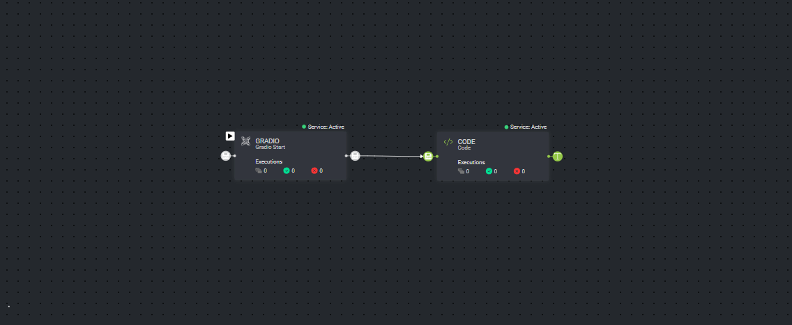
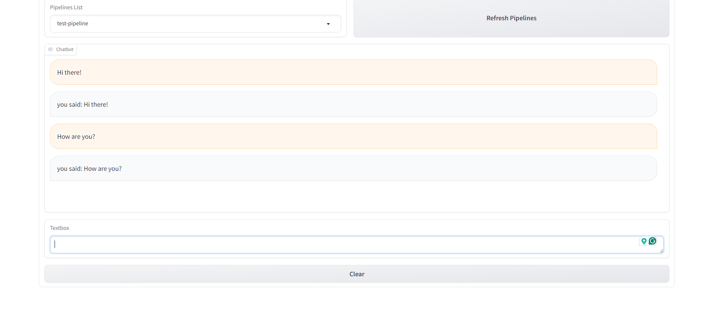

# Gradio Ingest

## Nodes

1. Gradio Start - will start a pipeline execution from the user's text input.

## Init Inputs

The pipeline name is required to enable the start of the pipeline from the Slack App.

## Example

We'll build the following pipeline:


Code node:

```python
import dtlpy as dl


class ServiceRunner:

    def run(self, messages):
        return f"you said: {messages[-1]['content']}"

```

NOTE: The output of the last node must be a string.

Navigate to the Gradio interface and start a conversation:
