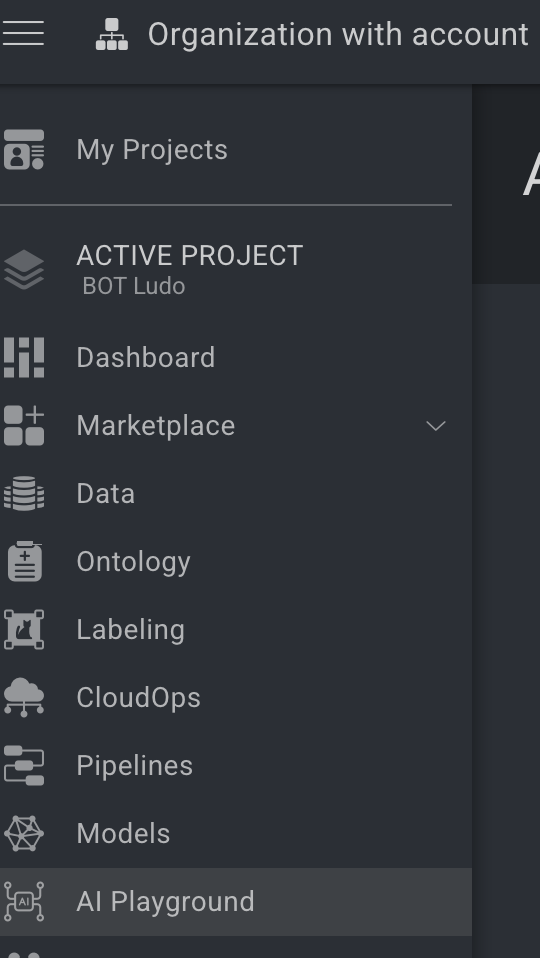
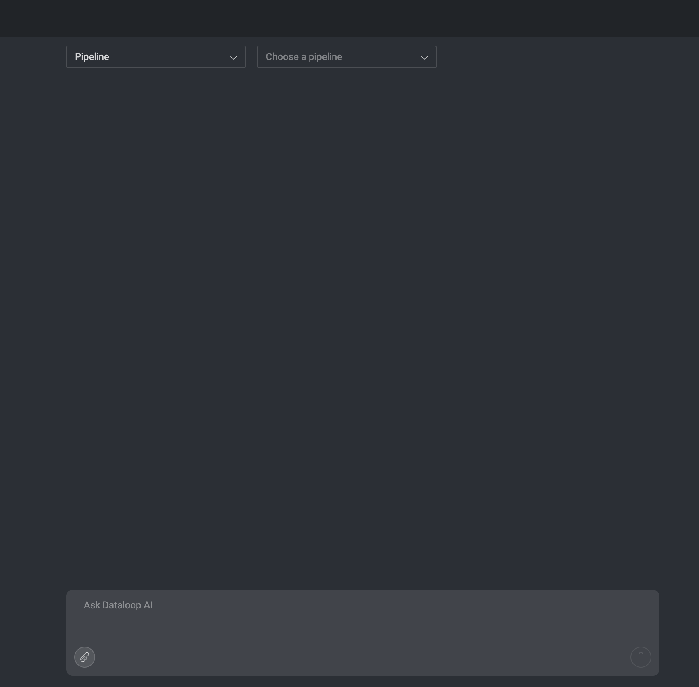

# DDOE AI Chat Application

## Overview

This project implements an interactive AI-powered chat application using FastAPI for backend services, Vue.js for the frontend, and DDOE's SDK for AI model and pipeline integration. Users can interact with AI models or pipelines by sending text messages and optionally uploading images.

## Project Structure

-   **Backend (`backend.py`)**: FastAPI server that handles API requests, manages sessions, uploads files, and streams AI-generated responses.
-   **Frontend (`src/App.vue`)**: Vue.js application providing an interactive chat interface, allowing users to select AI models or pipelines, send messages, and view responses.
-   **Main Entry Point (`main.py`)**: Initializes and runs the backend server using Uvicorn.
-   **Configuration (`dataloop.json`)**: Contains project-specific configurations for DDOE integration.

## Features

-   **AI Integration**: Seamlessly connects with DDOE AI models and pipelines.
-   **Real-time Streaming**: Streams AI-generated responses in real-time using Server-Sent Events (SSE).
-   **File Uploads**: Supports image uploads to enhance AI interactions.
-   **Session Management**: Maintains user sessions and chat history within DDOE datasets.
-   **Interactive UI**: Provides a responsive and intuitive chat interface built with Vue.js.

## Backend API Endpoints

-   `POST /start-stream`: Initiates a new chat session, uploads optional images, and prepares the AI pipeline or model execution.
-   `GET /stream`: Streams AI-generated responses back to the frontend in real-time.

## Getting Started

### Prerequisites

-   Python 3.8+
-   Node.js (for frontend)
-   DDOE account and API credentials

### Installation

#### Backend Setup

1. Install Python dependencies:

```bash
pip install fastapi uvicorn dtlpy numpy python-multipart
```

2. Run the backend server:

```bash
python main.py
```

#### Frontend Setup

1. Install frontend dependencies from the project's root directory:

```bash
npm install
```

2. Run the frontend application:

```bash
npm run dev
```

3. Run the backend

```bash
python backend.py
```

4. Start Nginx with configuration

## Usage

-   Choose AI playground from the Menu
    
-   Choose Pipeline or Model and start to type in chat
    
